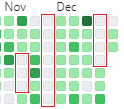

## 🗒️11월의 약속들

### 웹 개발 공부✅
[Supabase](https://supabase.com/) 를 배우고, 이것을 사용해서 프로젝트를 하나 만들어 보기로 했었다. 두개의 프로젝트를 만들었는데, [무작위 미술관](https://random-image-museum.vercel.app/)([github](https://github.com/jindun619/random-image-museum))과 [김호준 갤러리](https://gallery.hoojun.kim/)([github](https://github.com/jindun619/hoojun-gallery))이다. 자주 사용되는 백엔드 처리를 Supabase에서 다 해주니까 매우 편리했다. 나중에 사이드 프로젝트를 진행할 때 복잡한 백엔드가 필요 없으면 사용하기 좋을 것 같다.

### 일렉기타 연습✅
하루 최소 한시간은 연습하는 것 같다. 무엇보다 너무 재밌어서 누가 시키지 않아도 하게 된다. 사실 요즘 최대 관심사가 기타이다, 군생활하면서 열심히 연습하고 전역 직후에 비싼 기타를 살 계획이다. 복학하면 학교 밴드 동아리에 들어가고 싶다. 노래 연습도 좋지만 기본기를 탄탄하게 다지기 위해 크로매틱  연습도 게을리 하지 않겠다.

### 규칙적으로 공부하는 습관❌
비록 매일 공부는 했지만, 예전처럼 새벽부터 밤까지의 엄격한 공부 스케줄을 완벽하게 지키지는 못했다. 이는 각기 다른 사정 때문이었지만, 진정한 자기 관리란 이러한 사정조차 발생하지 않게 하는 것임을 잘 알고 있다. 그래서 1월에는 더욱 규칙적으로 공부하는 데 집중하려고 한다. 또한, 휴가 중에는 보통 공부를 하지 않았지만, 이로 인해 장기간 쉬게 되고, 돌아온 후에 다시 집중하는 데 시간이 많이 소요된다는 것을 깃허브 커밋 기록이 보여준다. 1월에 휴가를 자주 가게 될 텐데, 이때 공부 패턴이 무너지지 않도록 특별히 주의하겠다.
 
 
## ✅12월에 한 일들

###  Supabase 토이프로젝트 진행
위에 잠깐 언급했듯이, [무작위 미술관](https://random-image-museum.vercel.app/)([github](https://github.com/jindun619/random-image-museum))과 [김호준 갤러리](https://gallery.hoojun.kim/)([github](https://github.com/jindun619/hoojun-gallery))를 만들었다. 자세한 소개는 추후에 따로 게시글을 올릴 계획이다.

### OpenAI API & Langchain 공부
OpenAI API(Chat GPT API)와 Langchain공부를 시작했다. 아직은 웹개발이 너무 재밌지만, 다양한 분야의 공부를 경험해봐야 할 것 같아서 원래부터 관심 있었고 또 요즘 매우 트렌디한 Chat GPT를 공부하기로 했다. 진입장벽을 낮추기 위해 존경하는 [니꼬쌤](https://nomadcoders.co/)의 [풀스택 GPT 강의](https://nomadcoders.co/fullstack-gpt)강의도 구매했다(+Chat GPT Plus). 또한, OpenAI API를 더욱 효과적으로 활용하기 위해 Langchain을 병행하여 사용중이다.
공부를 시작하고 느낀건데, 생성형 AI는 정말 굉장한 기술인 것 같다. 내가 취직할 때 쯤에는 IT 트렌드가 또 바뀌어 있겠지만, 지금 생성형 AI 공부를 통해서 최신 트렌드를 공부하는 연습을 해놓으면, 분명히 좋은 스펙이 될 것이고, IT 트렌드에 대한 통찰력을 키울 것이라 확신한다.

## 🔥1월에 할 일들

### Chat GPT 공부
Chat GPT API와 Langchain을 공부해서 재밌는 앱을 만들어 보겠다.

### 규칙적으로 공부하는 습관
저번달에 잘 지켜지지 않았으니 이번달에도 목표 리스트에 넣었다. 저번달에 가장 큰 방해요소는 휴가, 풋살 그리고 기타였다. 해결방안으로: 1. 휴가때 매일 최소 1시간 공부를 하겠다; 2. 풋살은 일주일 최대 두번만 하겠다; 3. 공부시간이라고 정해둔 시간에는 기타를 치지 않겠다.

### 일과시간 낭비하지 않기
일과시간에 남는 시간을 허무하게 날리지 않고 독서 혹은 성경필사를 하겠다(엄마께서 전역 전까지 성경책 전체 필사를 하면 200만원을 일시불로 준다는 파격적인 제안을 하셨다. 꼭 성공해서 고가 일렉기타를 사겠다🔥🎸).

## ☀️한 해를 되돌아보며
2023년이 온전히 군복무로 채워졌다는 사실이 아직도 믿기지 않지만, 이번 한 해는 의외로 만족스러웠다. 연초에는 군 생활의 어려움에 육체적, 정신적으로 많이 지쳤지만, 그 시간들이 오히려 많은 것을 배우고 성장하는 기회가 되었다. 더욱이, 귀중한 인연들을 만난 것은 큰 기쁨이었다. 새로운 사람들과의 만남 덕분에 군생활이 즐겁고 의미 있는 시간으로 변했고, 내 삶에 긍정적인 영향을 주었다. 면회와 휴가 때 시간을 내어 함께해준 가족과 친구들에게도 깊은 감사의 마음을 전하고 싶다.

많은 사람들이 군대에서의 시간을 낭비라고 말하지만, 나에게는 그렇지 않았다. 군 복무 기간은 내 삶을 되돌아보고, 미래를 설계할 수 있는 소중한 시간이었다.

새해에는 아직 불확실한 내 미래가 조금 더 명확해지기를 바란다.
