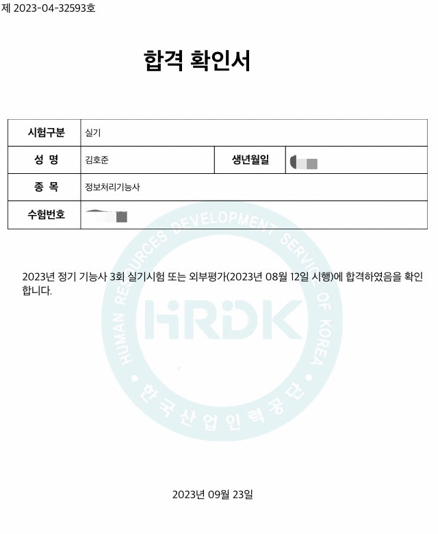

## ✔️9월에 한 일들

### 정보처리기능사 자격증 취득
스펙에 크게 보탬이 될 것 같진 않지만, 컴퓨터 기초 지식 배우기 + 휴가 벌이 목적으로 땄다. 실제로 애매하게 알고있었던 컴퓨터 지식들을 좀 더 구체적으로 배울 기회가 되어서 좋았다. 필기 10일, 실기 3주 총 한달 조금 넘는 시간동안 독서연등시간을 활용해서 준비했다.

### 블로그 개설
[Velopert님의 블로그](https://velopert.com/)를 보고 영감을 받아 미뤄뒀던 블로그 개발을 실행으로 옮겼다. [Gatsby](https://www.gatsbyjs.com/)라는 유용한 리액트기반의 프레임워크를 이용해서 2주간의 개발을 통해 [Hoojun.Kim](https://hoojun.kim/)을 개설했다. 도메인 이름을 고민하던 중에, [GoDaddyKR](https://kr.godaddy.com/)에서 홍보하던 .kim 도메인에 꽂혀서 바로 구매했다. 이만큼 나를 잘 나타낼 수 있는 도메인은 없을 것 같다, 매우 만족스럽다.

### 생산적인 삶
블로그 개발을 시작하면서 개발에 대한 열정을 다시 되찾았다. 내 인생을 되돌아보면, 나는 내가 좋아하는 일에 몰두했을때 가장 행복했던 것 같다. 그 좋아하는 일들 중 하나가 개발이다. 군대에서 시키는 일만 하고 특별한 목표 없이 재밌는 일만 찾아다니는 삶은 좋았지만, 그것은 현실도피가 가져다주는 일시적인 즐거움인걸 알고있다. 지금의 열정을 가지고 전역후에 생각했을때, 군대에서 많은것을 얻었다고 생각할 수 있도록 열심히 살 것이다. 이것을 이루기 위해 이번달에 한 노력은:
1. 출근 전 1시간 공부(1시간 더 일찍 기상)
2. 점심시간 1시간 공부(원래는 놀거나 낮잠을 잤다)
3. 개인정비시간 3시간 공부
4. 연등시간 2시간 공부
이다. 매일 좋아하는 공부를 하고 내가 성장하는 것이 느껴져서 하루하루가 즐겁다. 지금 마음가짐이 변하지 않고 앞으로도 쭉 이어졌으면 좋겠다.

### 금연
내가 군대에 와서 배운 가장 안좋은 것은 담배이다(사실 누가 가르쳐주진 않았다, 그냥 혼자 시작했다). 계산을 해 보니까, 일병 1호봉때부터 약 8개월동안 평균 3일에 두갑을 폈으니까, 총`(2/3*30*8=)160`갑을 핀 것이고, `(160*4500=)720,000`만원을 썼으며, `(160*20*5=)16,000`분,  곧 `266.7`시간을 쓴 것이다.

>한달은 30일, 한갑에 4,500원, 한개피 피는데 5분이라고 칩시다.

추가로 육체적 건강과 정신적 건강을 생각하면 빨리 끊을수록 이득이라는 생각이 들었다. 담배를 끊으면 한달에 약 9만원이 절약이 되는데, 삼성전자가 한 주에 7만원정도 하더라, 어차피 없어졌을 돈 버렸다고 생각하고 매달 월급날에 한 주씩 살 계획이다(주식에 대해 아는게 없어서 국룰 삼전ㄱㄱ)

### 기타 연습
우리 생활관에 기타 고수가 두명이나 있는건 정말 큰 행운이다. 4월에 시작해서 약 5개월간 배웠는데, 아직 밖에서 보여주고 다닐 실력은 못되지만 실력이 조금씩 늘고있는 것이 느껴진다. 아직 한 곡을 마스터하진 않았고, 좋아하는 노래들을 돌아가면서 연습하고 있다:
- 검정치마 - 기다린 만큼, 더
- 너드커넥션 - 좋은 밤 좋은 꿈
- 너드커넥션 - 대나무숲
- 너드커넥션 - 조용히 완전히 영원히
- 이문세 - 깊은밤을 날아서 (Cover by 예빈나다)

## 🔥10월에 할 일들

### 자격증 따기
개인정비시간, 연등시간은 싸지방에서 개발 공부를 할 수 있지만, 일과중에 작업이 없을 때 남는 시간들은 항상 낭비가 된다. 독서를 해서 교양을 쌓아도 되지만 책은 너무 지루해서 그 시간들을 자격증 공부를 해서 채우려 한다. 그나마 내 분야와 관련이 있고, 비교적 만만하며 휴가도 주는 컴퓨터활용능력 1급을 도전해볼 생각이다. 필기 시험일자은 10월 28일 or 10월 29일로 생각하고 있다.

### 공부 분야 탐색&실행
최근에는 블로그 개발을 위해 Gatsby, React, GraphQL등을 공부했다. 웹개발 공부도 재밌지만 IT쪽의 여러 분야를 경험해보고 어떤 분야가 내 적성에 맞나 알아보고 싶다.

### 규칙적인 생활패턴 가지기
위에서 말한것처럼 나는 요즘 군대에 있음에도 불구하고 시간관리를 통해 하루에 7시간의 공부시간을 확보했다. 생산적으로 사는건 좋으나, 수면시간이 꽤 부족한 것을 느꼈다(하루에 6시간 조금 안되게 잤다). 부족한 수면은 집중력과 창의력을 하락시켜 도리어 공부 효율을 떨어뜨릴 수 있겠다는 생각이 들었다. 게다가 건강에도 좋지 않을 것 같다. 잠을 줄이고 공부를 하게된지 3주정도가 됐는데, 피부가 눈에띄게 안좋아지고, 성격도 예민해진 것이 느껴진다. 건강을 위해서라도 충분한 수면시간을 가져야겠다.

### 기타 연습
하루 최소 30분은 집중해서 연습할 것이다!